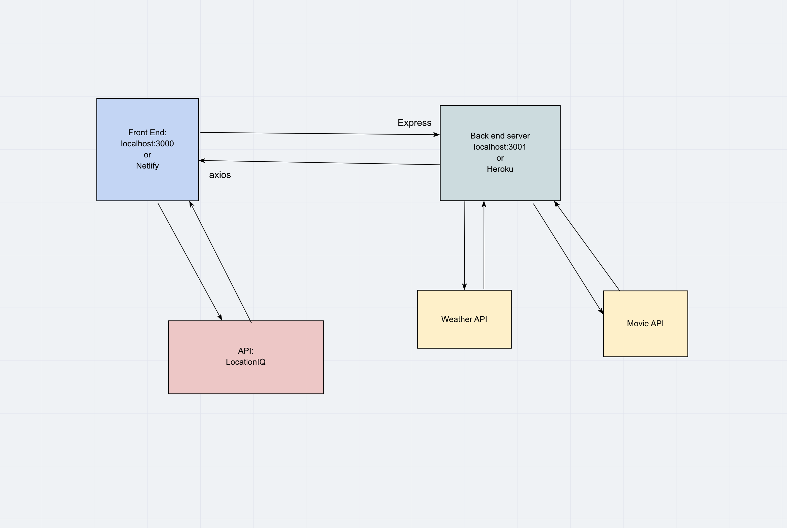

# city-explorer-API

# Project Name

**Author**: Jessi Velazquez
**Version**: 1.4.0 

## Overview
<!-- Provide a high level overview of what this application is and why you are building it, beyond the fact that it's an assignment for this class. (i.e. What's your problem domain?) -->
A server back end for city-explorer

## Getting Started
<!-- What are the steps that a user must take in order to build this app on their own machine and get it running? -->
1. Clone Github Repositories for front end and back end
2. install nodemon
3. connect to nodemon for the back end
4. connect to npm for the front end

## Architecture
<!-- Provide a detailed description of the application design. What technologies (languages, libraries, etc) you're using, and any other relevant design information. -->

## Change Log
<!-- Use this area to document the iterative changes made to your application as each feature is successfully implemented. Use time stamps. Here's an examples:

01-01-2001 4:59pm - Application now has a fully-functional express server, with a GET route for the location resource. -->
03-23-2021 8:40pm - Server is running and is serving static data to city-explorer front end
03-24-2021 11:24pm - Server is running locally and serving weather API data to front end upon request. Server is deploed to heroku but there is an issue with it not sending API data to front end. Currently for the app to work, nodemon must be run locally.
03-25-2021 11:24pm - Server code has been refactored into function module file and main server.js file. Server is still running locally and serving weather API data to front end upon request. Server is deployed to heroku but there remains to be an issue with it not sending API data to front end. Currently for the app to work, nodemon must be run locally.
03-28-2021 4:02pm - Application now function with a cache on the weather back end and uses inMemoryDB() on the movies back end. Site is successfully deployed, and server is running off of Heroku.

## Credit and Collaborations
<!-- Give credit (and a link) to other people or resources that helped you build this application. -->

Pair programming partner: Jeremy Brazell

Name of feature: Server set up and initiation to front end

Estimate of time needed to complete: 6 hours

Start time: 1:00pm

Finish time: 8:45pm

Actual time needed to complete: 7.75 hours

Name of feature: Weather API 

Estimate of time needed to complete: 5 hours

Start time: 1:00pm

Finish time: 7:30pm

Actual time needed to complete: 6.5 hours

Name of feature: Refactor and Nested component

Estimate of time needed to complete: 3 hours

Start time: 5:30pm

Finish time: 7:45pm

Actual time needed to complete: 2.25 hours

Name of feature: Refactor Weather Back End to Match Demo Code

Estimate of time needed to complete: 6 hours

Start time: 4:30pm Friday

Finish time: 8:30pm Friday

Start time: 1:00pm Saturday

Finish time: 5:30pm Saturday

Actual time needed to complete: 8.5 hours

Name of Feature: Refactor Movies Back end to match demo code

Estimate of time needed to complete: 6 hours

Start time: 12:30pm Sunday

Finish time: 4:00pm Friday

Actual time needed to complete: 3.5 hours